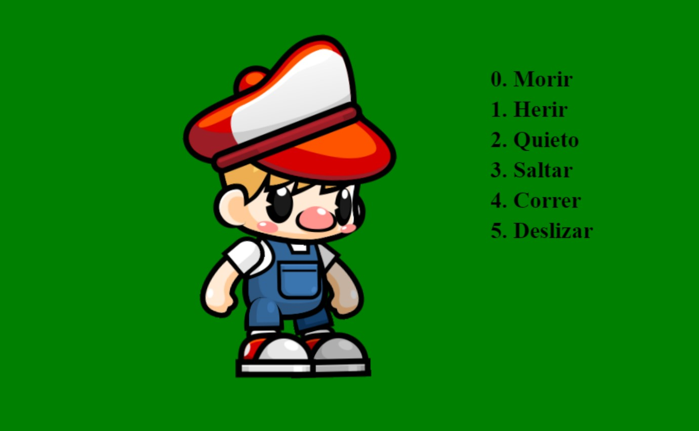

# Descripción del Proyecto

## Título: Moviento de personaje

## Descripción:
Este proyecto es un videojuego de plataforma desarrollado en JavaScript. El juego presenta un personaje principal, controlado por el jugador, que puede realizar varias acciones. 

## Personaje Principal:
El personaje es un dibujo animado con un estilo gráfico adorable y simple. Viste una gorra roja y un overol azul, y tiene una expresión facial amigable.

## Acciones del Personaje:
Las acciones que puede realizar el personaje son las siguientes:

0. **Morir**
1. **Herir**
2. **Quieto**
3. **Saltar**
4. **Correr**
5. **Deslizar**

## Tecnologías Utilizadas:
- **JavaScript**
- **HTML/CSS**
- **Canvas**
## Captura de pantalla:

